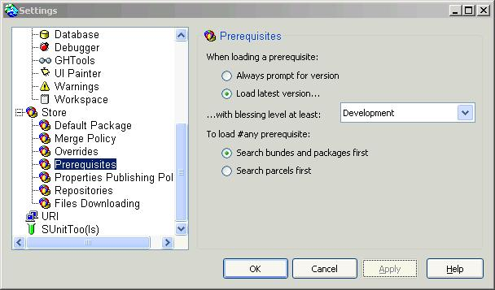
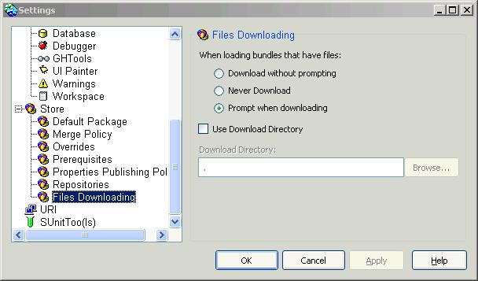

# Loading JNIPort from a Store Repository

For working with JNIPort for VisualWorks, you have to load several packages and bundles from Cincom's Public Store Repository or another Store repository to which JNIPort has been replicated.
Preparation

If you load JNIPort directly from Store, make sure that you have configured Store to "search bundles and packages first" in the VisualWorks settings. Otherwise, Store will load parcels which come with the VisualWorks distribution and which may be outdated. Of course, if you have checked that the parcels from your VisualWorks distribution are up to date, you can also load those instead of the versions in the Public Repository.

You can either select versions of prerequisite bundles and packages manually, or just let Store load the latest versions which have a blessing level of at least "Development":

The bundle JNIPort includes two files which you will need. In the "Files Downloading" section of the Store settings, check "Download without prompting" or "Prompt when downloading":

## Loading JNIPort

_This section ist outdated - JNIPort 3.0 has been available for quite some time in the Public Store repository._

If you are working with VisualWorks 7.6 or earlier, you have to load an additional package which contains methods already included in the VisualWorks 7.7 base image, but not yet present in earlier versions. This package has to be loaded manually, because VisualWorks does not support the definition of prerequisites which depend on the image version. The package is named

- JNIPort VW75 Extensions 2.0 (for VisualWorks 7.5 or earlier)
- JNIPort VW76 Extensions 2.0 (for VisualWorks 7.6)

To work with JNIPort, load the following bundles:

- JNIPort 2.0
- JNIPort Tools 2.0 (optional)
- JNIPort Tests 2.0 (optional)

Loading JNIPort will also load the following:

- DLLCC
- Registry
- FastCMethodPointers
- WeakCollections
- JNIPort Prerequisites

When loading the bundle JNIPort, two files which are attached to the bundle will be stored in your file system:

- JNIPort_Docs.zip
- JNIPort_Extras.zip

Replicating JNIPort to your local repository

Usually, you will want to replicate JNIPort to your local Store repository, such that you can work with it without having access to the Public Repository. You should replicate the following packages and bundles:

- Registry 28
- FastCMethodPointers 1.1
- WeakCollections 5
- JNIPort VW75 Extensions 2.0 (for VisualWorks 7.5 and older versions)
- JNIPort VW76 Extensions 2.0 (for VisualWorks 7.6)
- JNIPort Prerequisites 2.0
- JNIPort 2.0
- JNIPort Tools 2.0
- JNIPort Tests 2.0

If newer versions are available, you should choose the latest version with blessing level "Development" or higher respectively.